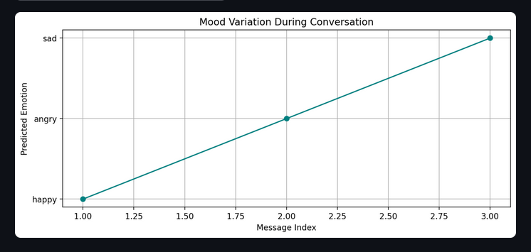

# 🧠 Emotional Support Chatbot

This is a Deep Learning-powered **Emotion-Aware Chatbot** designed to provide **empathetic responses** to user messages. It combines emotion detection using a trained RNN model with natural language generation powered by **Gemini Pro**. The user interface is built with **Streamlit** for easy interaction and visualization.

[emotional-support-chatbot](https://emotional-support-chatbot.streamlit.app/)

---

## 📊 Dataset & Emotion Labels

The dataset was extracted from **Reddit** and labeled manually across **9 emotion classes**:
It consists of 29,419 rows and 5 columns. 
The 5 columns are :
- Post_id
- Title 
- Text	
- emotion	
- subreddit (the community from where the post was scrapped)


The 9 emotion classes : 
- fearful
- depressed
- happy
- regret
- angry
- sad
- surprised
- neutral
- disgusted

Each Reddit post/comment was preprocessed, cleaned, and labeled using a structured pipeline.

---

## 🧹 Data Cleaning Steps

The raw Reddit data was cleaned using:
- Lowercasing
- Removal of URLs, HTML tags, and special characters
- Tokenization
- Lemmatization
- Removal of stopwords

This ensured consistent and high-quality input for training.

---

## 🤖 Model Training & Evaluation

Several models were trained and evaluated for emotion classification:

| Model              | Accuracy |
|--------------------|----------|
| Naive Bayes        |    38%   |
| SVM                |    53%   |
| ANN                |   53.84% |
| RNN(Bidirectional) | **60.10%** |

The **Bidirectional RNN model in PyTorch** achieved the best trade-off between performance and interpretability and was chosen for deployment.

---

## 🌐 Application Architecture

```bash
User Input
    │
    ▼
[gemini_predict.py] Emotion Prediction using RNN model
    │
    ▼
[gemini_response.py] Empathetic response generation (via Gemini Pro)
    │
    ▼
[Streamlit UI] gemini_app.py – Input, Output, and Mood Graph
```

---

## 📷 Project Flow & UI Screenshots

Below are some screenshots that show the app flow from user input, emotion prediction, Gemini-generated response, to final emotion trend graph.


1. User input :


2. On **Clicking Generate Response** : 


3. The conversation continues...


4. The moment you hit **End Conversation and Show Mood Graph** , a graph showing the variation in mood corresponding to the user's input will be displayed.


---

## 🚀 How to Run


The app has been deployed on Streamlit's public cloud. [Click here](https://emotional-support-chatbot.streamlit.app/) to open the chatbot.


If you wish to run the project locally on your system then follow : 

### 1. Clone the repo
```bash
git clone https://github.com/ShashankRaturi/Emotional-Support-Chatbot.git
cd Emotional-Support-Chatbot
```

### 2. Set up environment
```bash
python -m venv venv
source venv/bin/activate  # On Windows: venv\Scripts\activate
pip install -r requirements.txt
```

### 3. Add your Gemini API key
Create a `.env` file in the root directory:
```env
GOOGLE_API_KEY="your_api_key_here"
```

### 4. Run the app
```bash
streamlit run app.py
```

---

## 💡 Features

- Emotion detection from user input text
- Empathetic reply generation via Gemini Pro
- Mood trend visualization using Matplotlib
- Clean and simple Streamlit interface

---

## ☁️ Deployment

This app is designed to be **hosted on Streamlit Cloud**, avoiding the need for heavy model downloads by using **Gemini API for response generation**.

---

## ✨ Author

**Shashank Raturi**  
[GitHub](https://github.com/ShashankRaturi)
